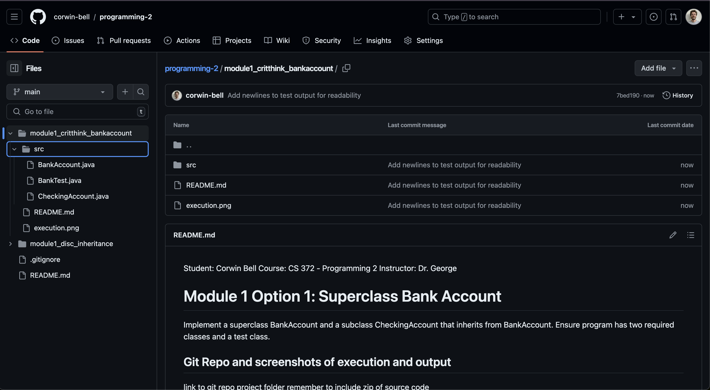
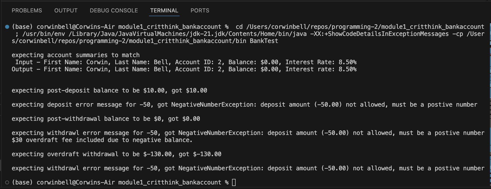

Student: Corwin Bell  
Course: CS 372 - Programming 2  
Instructor: Dr. George  
# Module 1 Option 1: Superclass Bank Account
Implement a superclass BankAccount and a subclass CheckingAccount that inherits from BankAccount.
Ensure program has two required classes and a test class.

## Git Repo and screenshots of execution and output
[Git Project Folder Link](https://github.com/corwin-bell/programming-2/tree/main/module1_critthink_bankaccount)  
### Git repo screenshot

### Execution screenshot

converted to PDF using [md-to-pdf](https://github.com/simonhaenisch/md-to-pdf)