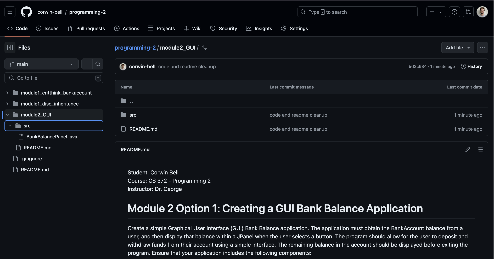

Student: Corwin Bell  
Course: CS 372 - Programming 2  
Instructor: Dr. George  
# Module 2 Option 1: Creating a GUI Bank Balance Application
Create a simple Graphical User Interface (GUI) Bank Balance application. The application must obtain the BankAccount balance from a user, and then display that balance within a JPanel when the user selects a button. The program should allow for the user to deposit and withdraw funds from their account using a simple interface. The remaining balance in the account should be displayed before exiting the program. Ensure that your application includes the following components:
- JPanel
- JButton
- ActionListener

## Git Repo and screenshots of execution and output
[Git Project Folder Link](https://github.com/corwin-bell/programming-2/tree/main/module2_GUI)  
### Git repo screenshot

### Execution screenshot

converted to PDF using [md-to-pdf](https://github.com/simonhaenisch/md-to-pdf)