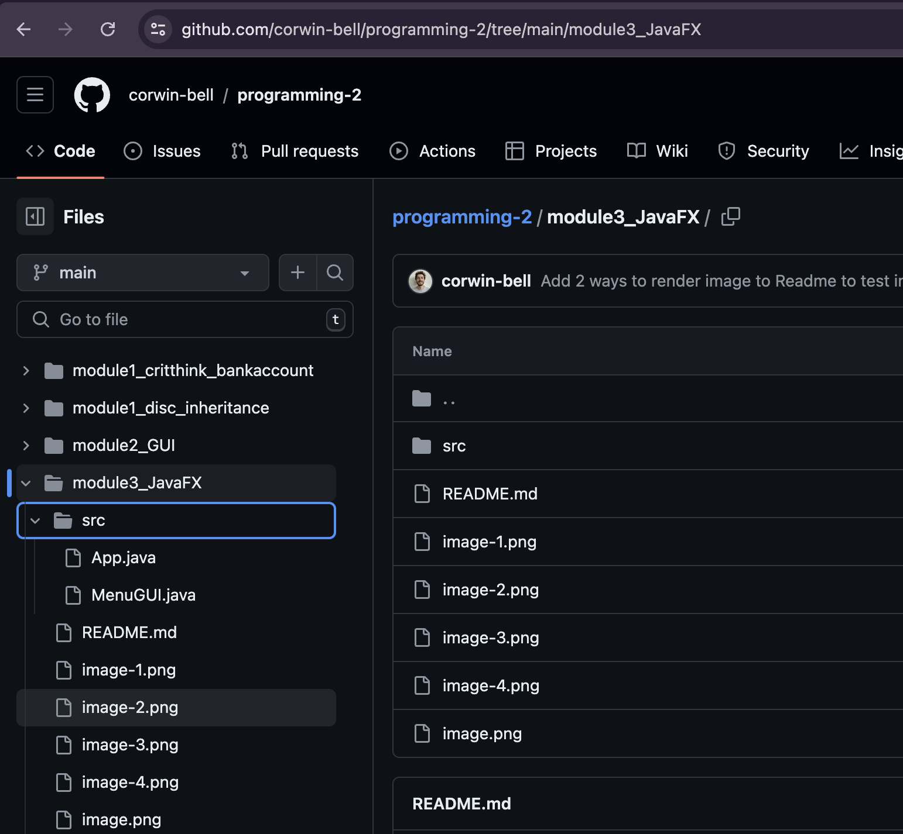
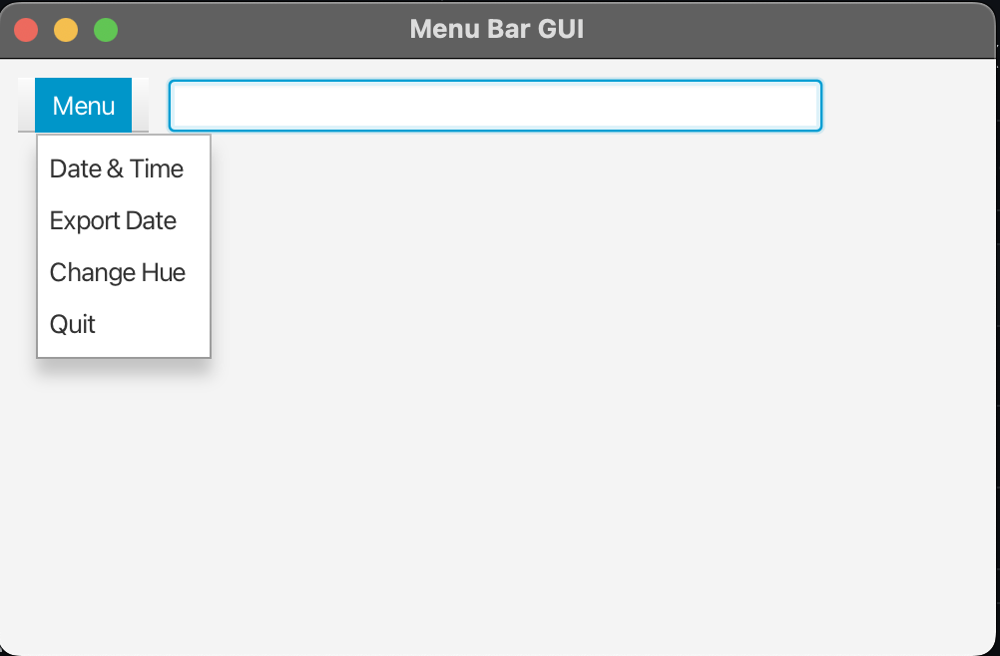
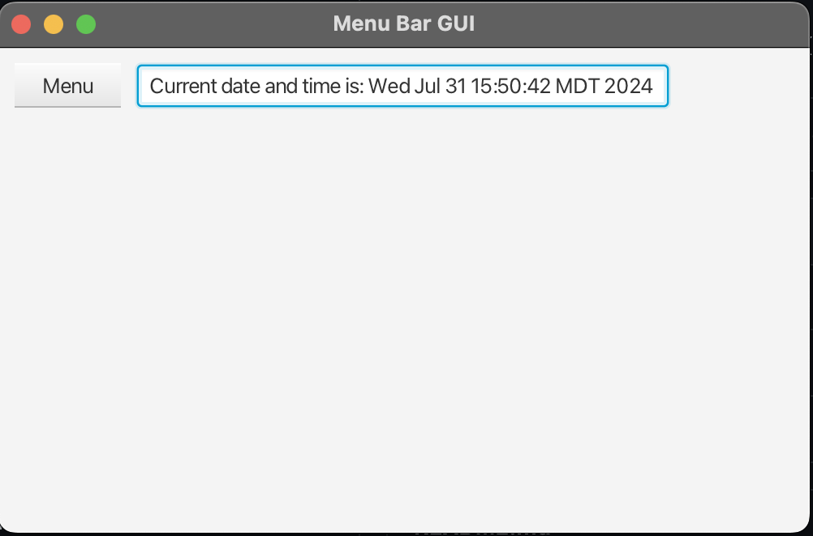
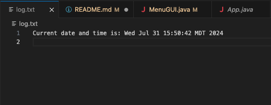
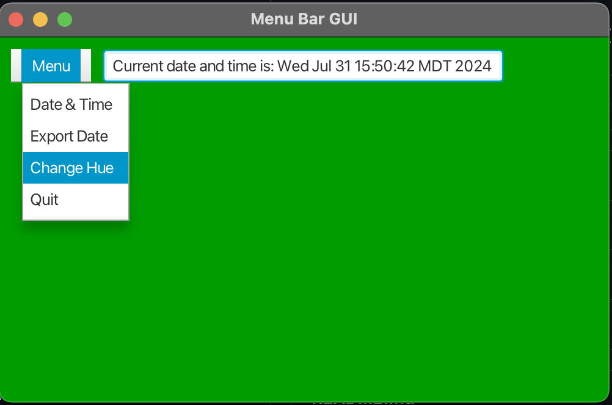
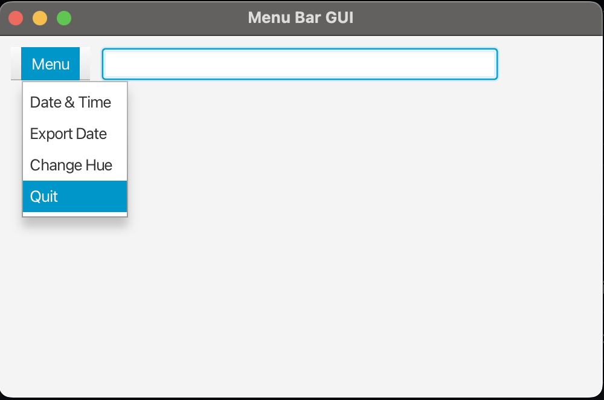

Student: Corwin Bell  
Course: CS 372 - Programming 2  
Instructor: Dr. George  
# Module 3 Option 1: Creating User Interface I
Create a user interface that has a top bar that includes a menu. The menu should have four items:
1. When the user selects the first menu option, then the date and time should be printed in a text box.
2. When the user selects the second menu option, then the text box contents should be written to a text file named "log.txt."
3. When the user selects the third menu item then the frame background color changes to random color hue of the color green. 
4. When the user selects the fourth menu option then the program exits.

## Git Repo and screenshots of execution and output
[Github Project Folder Link](https://github.com/corwin-bell/programming-2/tree/main/module3_JavaFX)  

### Git repo screenshot

### Execution screenshots
#### Initial State 

#### Date & Time

#### Export Date & Time to log.txt

#### Change to Random Hue of Green

#### Quit Program

converted to PDF using [md-to-pdf](https://github.com/simonhaenisch/md-to-pdf)