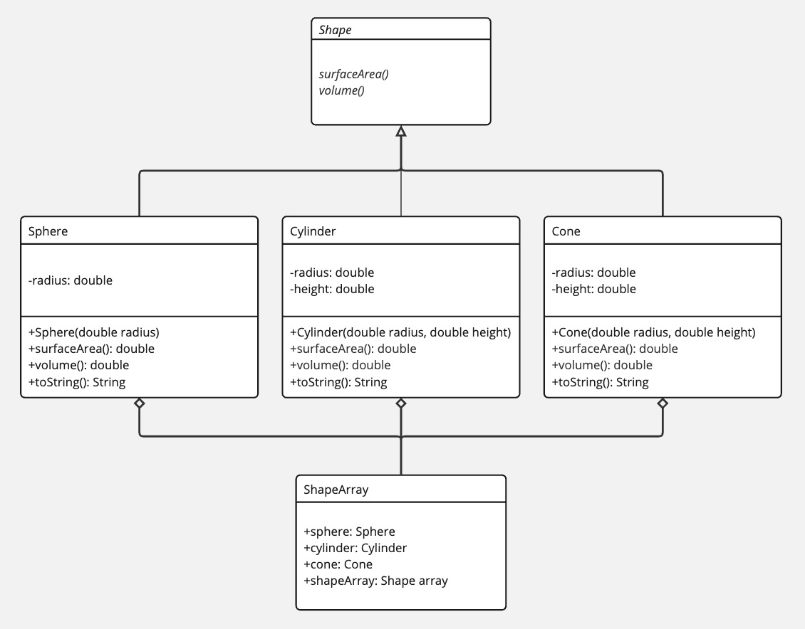

Student: Corwin Bell  
Course: CS 372 - Programming 2  
Instructor: Dr. George  
# Module 4 Option 1: Abstract Shape Class
Create an abstract Shape class with abstract methods and extend to the following concrete classes:
1. Sphere
2. Cylinder
3. Cone

In a Driver Class instantiate classes, add to array, and print shape information

## UML Diagram

## Git Repo and screenshots of execution and output
[Github Project Folder Link](https://github.com/corwin-bell/programming-2/tree/main/module4_OOP)  

### Git repo screenshot

### Execution screenshot

converted to PDF using [md-to-pdf](https://github.com/simonhaenisch/md-to-pdf)