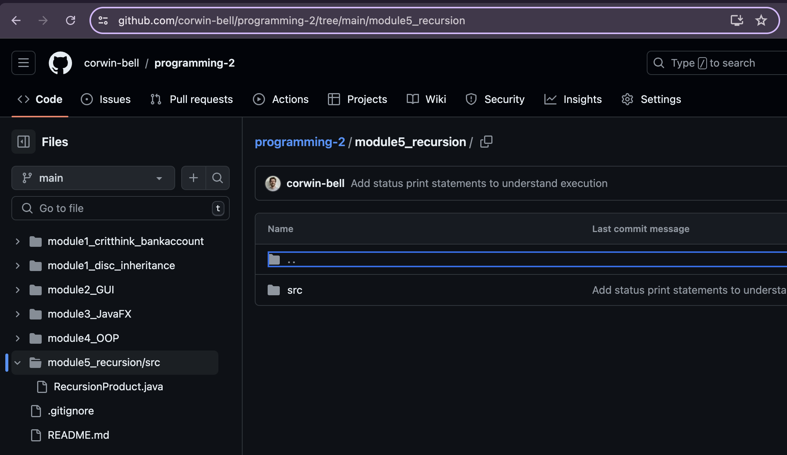
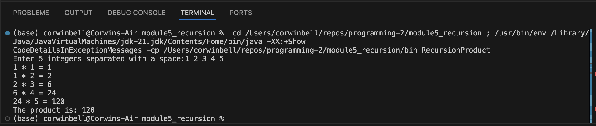

Student: Corwin Bell  
Course: CS 372 - Programming 2  
Instructor: Dr. George  
# Module 5 Option 1: Recursion Product
Using recursion, create a program that will allow a user to enter five numbers. The program will provide the product of all five numbers using recursive methods.

## Git Repo and screenshots of execution and output
[Github Project Folder Link](https://github.com/corwin-bell/programming-2/tree/main/module5_recursion)  

### Git repo screenshot

### Execution screenshot

converted to PDF using [md-to-pdf](https://github.com/simonhaenisch/md-to-pdf)