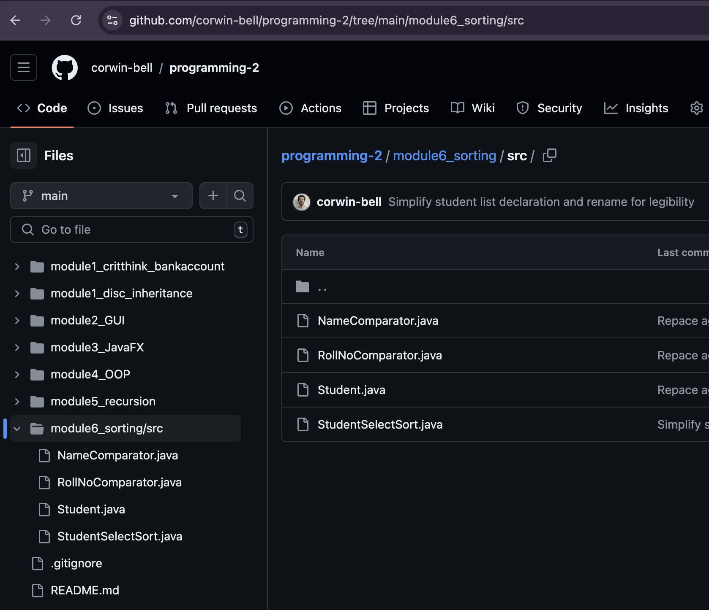
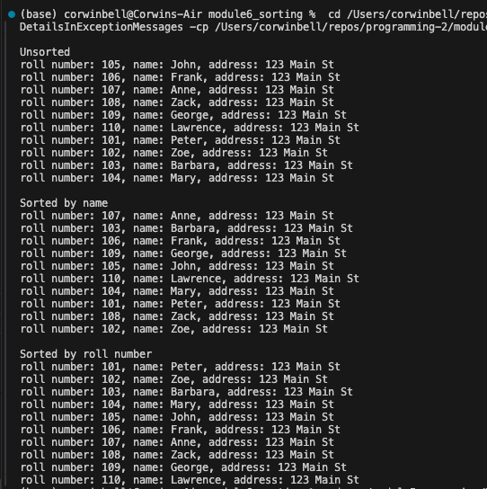

Student: Corwin Bell  
Course: CS 372 - Programming 2  
Instructor: Dr. George  
# Module 6 Option 1: Selection Sort with user defined comparator
Create a Java program that will store 10 student objects in an ArrayList, ArrayList<Student>. A student object consists of the following fields:
 * int rollno
 * String name
 * String address
Implement two comparator classes to sort student objects by name and by rollno (roll number). Implement your own selection sort method and place your code in a separate Java source file. Do not use a sort method from the Java collections library. 

## Git Repo and screenshots of execution and output
[Github Project Folder Link](https://github.com/corwin-bell/programming-2/tree/main/module6_sorting)  

### Git repo screenshot

### Execution screenshot

converted to PDF using [md-to-pdf](https://github.com/simonhaenisch/md-to-pdf)
