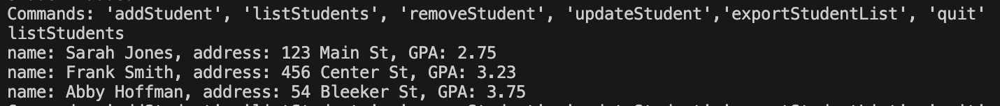

# Portfolio Project
## Final Program
Write a Java program that incorporates a loop that prompts the user for student data. Student data are private fields in a student class including:
- String name
- String address
- double GPA

Each student object is stored in a linked list.

After the user completes the data entry, output the contents of the linked list in ascending sorted order by name to a regular text file that can be opened and viewed using a simple plain-text editor such as notepad.

Validate numeric data for Grade Point Average (GPA).

Compile your Lessons Learned Reflection, source code, screenshots of the application executing, and results into a single document.

### Adding Students

### Listing Students unsorted

### Export sorted student list to text file

